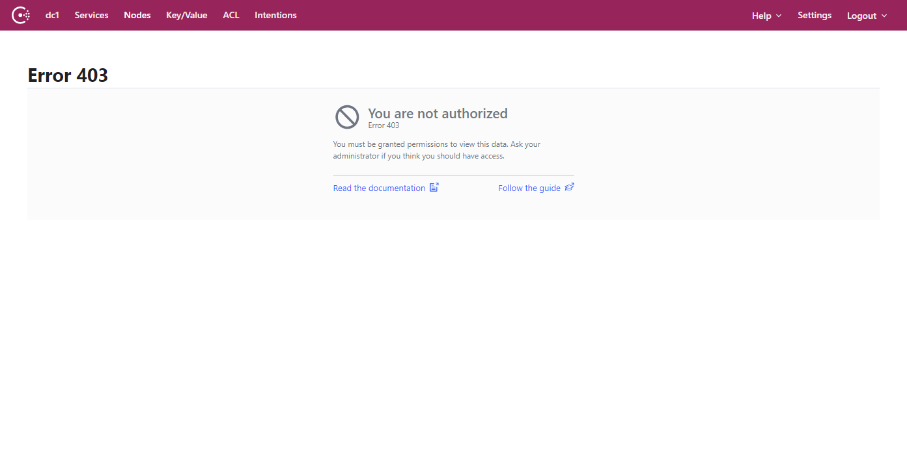

# AWS EKS Fargate With Consul Service Mesh Example

### Creates:

* EKS Cluster with Fargate Profile
* Security Groups and Subnets
* EFS Volumes and Access Points for Consul
* Kubernetes Volumes and Claims using EFS for Consul
* Consul Service Mesh via Helm Chart

## Install Terraform 1.13

https://releases.hashicorp.com

You will also need to set your AWS credentials for Terraform

https://registry.terraform.io/providers/hashicorp/aws/latest/docs#authentication

## Install aws-iam-authenticator

To use `kubectl` you need to install the aws-iam-authenticator to authenticate with the cluster.

https://docs.aws.amazon.com/eks/latest/userguide/install-aws-iam-authenticator.html

```shell
curl -o aws-iam-authenticator https://amazon-eks.s3.us-west-2.amazonaws.com/1.18.9/2020-11-02/bin/linux/amd64/aws-iam-authenticator
chmod +x ./aws-iam-authenticator
sudo mv ./aws-iam-authenticator /usr/local/bin
```

## Creating the cluster and installing consul

To use terraform to create the cluster run the following command

```shell
terraform init
terraform apply
```

## Patching Consul Controller

After the everything has been created you need the Consul controller to remove the reliance on the Daemonsets. This patch is automatically
applied but requires `kbuectl` to be present in your executable path.

## Patching CoreDNS

After the cluster has been created core dns is automatically patched, this requires `kubectl` to be
present in your executable path.

## Setting KUBECONFIG

The Terraform configuration will output a Kubernetes config file to the config folder, you can use this to connect to the Kubernetes
cluster using the following command.

```shell
export KUBECONFIG=$(terraform output kubectl_file)
```

If you then run the `kubeclt get pods command` you should see output similar to the below:

```
NAME                                                          READY   STATUS    RESTARTS   AGE
consul-connect-injector-webhook-deployment-68db554798-679ks   1/1     Running   0          8m30s
consul-controller-698c556f6-k2rkt                             2/2     Running   0          4m23s
consul-server-0                                               1/1     Running   0          8m29s
consul-server-1                                               1/1     Running   0          8m29s
consul-server-2                                               1/1     Running   0          8m29s
consul-webhook-cert-manager-667b4f5c8-jphcp                   1/1     Running   0          8m30s
```

The key thing in this output is that all pods are READY and RUNNING.

## Connecting to the Consul UI

The Consul UI and server is not exposed by a public loadbalancer, to connect to it you can use the port-forwarding
capability of `kubectl`.

In a new terminal run the following command:

```
kubectl port-forward svc/consul-server 8501
```

You also need an ACL token to access the cluster, this can be obtained from Kubernetes secrets using the following command.

```shell
kubectl get secret -o jsonpath='{.data.token}' consul-bootstrap-acl-token | base64 -d

6c9910fc-7db7-40de-a815-f349a336ae2c
```

To use the Consul CLI you can set the following environment variables.

```shell
export CONSUL_HTTP_ADDR=https://localhost:8501
export CONSUL_HTTP_TOKEN=$(k get secret -o jsonpath='{.data.token}' consul-bootstrap-acl-token | base64 -d)
export CONSUL_HTTP_SSL_VERIFY=false
```

With this configuration set you will be able to use the Consul CLI:

```shell
consul members

Node                               Address            Status  Type    Build  Protocol  DC   Segment
consul-server-0                    172.16.3.121:8301  alive   server  1.9.1  2         dc1  <all>
consul-server-1                    172.16.2.225:8301  alive   server  1.9.1  2         dc1  <all>
consul-server-2                    172.16.2.14:8301   alive   server  1.9.1  2         dc1  <all>
consul-controller-698c556f6-k2rkt  172.16.1.61:8301   alive   client  1.9.1  2         dc1  <default>
```

You can also open the Consul UI in your browser by visiting `https://localhost:8501`, you will need to login
to the UI using the ACL token you retrieved from the Kubernetes secrets in a previous step.
 


## Running applications

Due to the unavailability of Daemonsets on EKS Fargate, Consul's mutating webhook that is responsible
for injecting the data plane components needed by the service mesh does not currently work. HashiCorp's are working on officially 
supporting Fargate but until this is released you need to manually inject the service mesh pods.

To perform this task you can use the unofficial [EKS Fargate Consul Sidecar Injector](https://github.com/nicholasjackson/consul-fargate-injection).

The releases in the consul-fargate-injection repository contain a binary that can mutate a Kubernetes pod deployment YAML file and automatically
append the required items for Consul service mesh. Download the version for your operating system and ensure it is executable.

https://github.com/nicholasjackson/consul-fargate-injection/releases

Once installed you can use the binary to modify your deployments, let's modify the example deployment `api-v1.yaml` in the `app` folder to see 
how this works.  The file `api-v1.yaml` is a standard Kubernetes deployment as show in the following output:

```yaml
---
apiVersion: v1
kind: ServiceAccount
metadata:
  name: api-v1
automountServiceAccountToken: false

---
# API service version 1
apiVersion: apps/v1
kind: Deployment
metadata:
  name: api-v1
  labels:
    app: api-v1
spec:
  replicas: 3
  selector:
    matchLabels:
      app: api-v1
  template:
    metadata:
      labels:
        app: api-v1
        metrics: enabled
    spec:
      serviceAccountName: api-v1
      automountServiceAccountToken: true
      containers:
      - name: api
        image: nicholasjackson/fake-service:v0.20.0
        ports:
        - containerPort: 9090
        env:
        - name: "LISTEN_ADDR"
          value: "127.0.0.1:9090"
        - name: "NAME"
          value: "api v1"
        - name: "MESSAGE"
          value: "Response from API version 1"

```

This will create 3 instances of the API service, to inject the consul sidecars you run the following command.

```
consul-inject -deployment ./app/api-v1.yaml -service api-v1 -port 9090 -tls-enabled -acl-enabled > ./app/api-v1-with-sidecars.yaml
```

The consul-inject tool requires a number of parameters the first is `-deployment`, this is the name of the Kubernetes deployment that will be
mutated. Next you have `-service api`, this flag registers the name of the service `api` for your application in Consul. The `-port 9090` flag tells
Consul which port your application is listening on, the injected envoy proxy uses this information to send any requests destined for your service.
Finally you pipe the output to a new file `> ./app/api-with-sidecars.yml`.

Let`s now create the deployment.

```shell
kubectl apply -f ./app/api-v1-with-sidecars.yaml
```

If you query the cluster you will see the pods starting.

```shell
➜ k get pods
NAME                                                          READY   STATUS    RESTARTS   AGE
api-v1-64d678d544-d6mmr                                       0/3     Pending   0          14s
api-v1-64d678d544-hjc4l                                       0/3     Pending   0          14s
api-v1-64d678d544-rp7gj                                       0/3     Pending   0          14s
consul-connect-injector-webhook-deployment-68db554798-679ks   1/1     Running   0          92m
consul-controller-698c556f6-k2rkt                             2/2     Running   0          88m
consul-server-0                                               1/1     Running   0          92m
consul-server-1                                               1/1     Running   0          92m
consul-server-2                                               1/1     Running   0          92m
consul-webhook-cert-manager-667b4f5c8-jphcp                   1/1     Running   0          92m
```

Once the pods are running let's take a look at the Consul UI, you will be able to see the service `api-v1` registered successfully along
with the instances for each pod.


To demonstrate Consuls capability for L7 routing, lets also deploy a v2 of that same service.

```
consul-inject -deployment ./app/api-v2.yaml -service api-v2 -port 9090 -tls-enabled -acl-enabled > ./app/api-v2-with-sidecars.yaml
kubectl apply -f ./app/api-v2-with-sidecars.yaml
```

Let's now deploy the `web` application that will connect to the API service, again you can run the `consul-injector` command.
The command is very similar to last time you ran it, this time you set the service name to `web` and you are also adding `upstreams`. 
The upstream flag configures consul to expose the service `api` on `localhost` at port `9091`. This is the same convention you 
would use if you were configuring the service using the injector annotations. Previously you deployed two services `api

The example application you are deploying is a microservice that has been configured to call the upstream service `API` everytime 
it receives a request. The call to `API` uses the service mesh upstream that you configured using the `upstreams` flag.

Let's generate the file: 

```shell
consul-inject -deployment ./app/web.yaml -service web -port 9090 -upstreams api:9091 -tls-enabled -acl-enabled > ./app/web-with-sidecars.yaml
```

And apply it using `kubectl`:

```shell
kubectl apply -f ./app/web-with-sidecars.yaml
```

Once all of the pods are running, if you look at Consul you will see three services registered.


If you click on the Nodes tab in Consul, you will also see that there is a node registered for each of the
pods.


Finally lets create a Consul `ServiceRouter`, so you can route traffic between the different service
versions `api-v1` and `api-v2` using different HTTP paths.

```yaml
---
apiVersion: consul.hashicorp.com/v1alpha1
kind: ServiceRouter
metadata:
  name: api
spec:
  routes:
    - match:
        http:
          pathPrefix: /v1
      destination:
        service: api-v1
    - match:
        http:
          pathPrefix: /v2
      destination:
        service: api-v2
    - match:
        http:
          pathPrefix: /
      destination:
        service: api-v1
```

Since ACLs are enabled for the cluster by default service to service traffic is denied, you also need to create `Intentions` that explictly
allow `web` to talk to the `api-v1` and `api-v2` services.

```yaml
---
apiVersion: consul.hashicorp.com/v1alpha1
kind: ServiceIntentions
metadata:
  name: api-v1
spec:
  destination:
    name: api-v1
  sources:
    - name: web
      action: allow
```

The file `./app/config.yaml` contains all of this configuration, apply this configuration with the following command:

```shell
kubectl apply -f ./app/config.yaml
```

Let's test the application, the `web` application does not have a public service created for it however you can use `kubectl port-forward`
to expose a port locally. Run the following command in your terminal.

```shell
kubectl port-forward deployment/web 9090
```

```shell
Forwarding from 127.0.0.1:9090 -> 9090
Forwarding from [::1]:9090 -> 9090
```

You can then curl the endpoint of the service:

```shell
curl http://localhost:9090/v1
```

You should see a response similar to the below, if you look at the `upstream_calls` section
you will see the upstream request to the `api` that was made over the service mesh. If you run
this curl a few times you will see the `ip_addresses` of the upstream change as the service mesh
loadbalances your requests.

```json
➜ curl localhost:9090/v1
{
  "name": "web",
  "uri": "/v1",
  "type": "HTTP",
  "ip_addresses": [
    "172.16.2.28"
  ],
  "start_time": "2021-03-31T08:30:33.897020",
  "end_time": "2021-03-31T08:30:33.904217",
  "duration": "7.196101ms",
  "body": "Response from Web",
  "upstream_calls": {
    "http://localhost:9091": {
      "name": "api v1",
      "uri": "http://localhost:9091",
      "type": "HTTP",
      "ip_addresses": [
        "172.16.2.6"
      ],
      "start_time": "2021-03-31T08:30:33.903079",
      "end_time": "2021-03-31T08:30:33.903172",
      "duration": "91.073µs",
      "headers": {
        "Content-Length": "272",
        "Content-Type": "text/plain; charset=utf-8",
        "Date": "Wed, 31 Mar 2021 08:30:33 GMT",
        "Server": "envoy",
        "X-Envoy-Upstream-Service-Time": "1"
      },
      "body": "Response from API version 1",
      "code": 200
    }
  },
  "code": 200
}
```

Try another call, this time using the `v2` path, if you look at the `upstream_calls` section from the
output you will see that this time it shows the response from the V2 API.

```shell
curl http://localhost:9090/v2
```

## Destroying the demo

Running resources cost money so do not forget to tear down your cluster, you can run the `terraform destroy` command to remove 
all the resources you have created.

```shell
terraform destroy
```
